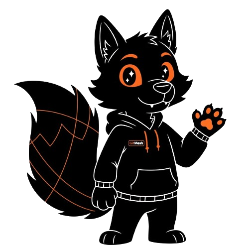

# GitMesh Gamification Ideas

<picture>
   <source srcset="public/mascott/meshy.png" media="(prefers-color-scheme: dark)">
   
</picture>

**Share Your Ideas to Make Open Source More Engaging!**

---

## 📌 Purpose

This document serves as a collaborative space for the GitMesh community to propose and discuss gamification features. Your ideas will help shape how we motivate contributors, recognize achievements, and build a more engaging open source experience.

As mentioned in our [ROADMAP](ROADMAP.md), we're planning to implement a **Gamification & Achievement System** where contributors can earn points, badges, and level-ups for various activities. This document helps us collect and organize your innovative ideas!

---

## 🎯 How to Contribute Ideas

We welcome all gamification ideas! Here's how to contribute:

1. **Open an Issue**: Create a new issue in the [GitMesh repository](https://github.com/LF-Decentralized-Trust-labs/gitmesh/issues) with the label `gamification` (for general gamification feature ideas) or `quest` (for specific quest/challenge-related ideas)
2. **Use This Template**: When submitting ideas, please include:
   - **Feature Name**: A catchy name for your idea
   - **Category**: Badge, XP System, Streak, Leaderboard, Reward, or Other
   - **Description**: Detailed explanation of how it works
   - **User Benefit**: How this motivates or helps contributors
   - **Example**: A concrete example of the feature in action (optional)

3. **Discussion**: Join the [weekly dev meetings](https://zoom-lfx.platform.linuxfoundation.org/meeting/96608771523?password=211b9c60-b73a-4545-8913-75ef933f9365) or our [Discord](https://discord.gg/xXvYkK3yEp) to discuss ideas with the community

---

## 💡 Idea Categories

### 🏅 Badges & Achievements

**What are they?**  
Visual recognition for specific accomplishments or milestones.

**Example Ideas:**
- **First Contribution Badge**: Awarded when a contributor makes their first merged PR
- **Bug Hunter**: Earned by reporting and helping fix critical bugs
- **Documentation Hero**: Recognized for improving or creating documentation
- **Code Reviewer**: Given to active code reviewers
- **Streak Keeper**: Maintaining contribution activity over consecutive weeks/months
- **Language Specialist**: Contributing code in multiple programming languages
- **Mentor Badge**: Helping onboard and guide new contributors

### ⭐ Experience Points (XP) System

**What is it?**  
A point-based system where contributors earn XP for various activities and level up.

**Example Ideas:**
- **Activity-based XP**: Different XP values for PRs, issues, reviews, documentation, etc.
- **Quality Multipliers**: Bonus XP for high-quality contributions (e.g., comprehensive tests, detailed docs)
- **Level System**: Bronze → Silver → Gold → Platinum contributor levels
- **Difficulty Scaling**: More XP for tackling complex issues or features
- **Team XP**: Shared XP bonuses when collaborating on features
- **Mentor XP**: Earn XP by helping other contributors succeed

### 🔥 Contribution Streaks

**What are they?**  
Tracking and rewarding consistent contribution patterns.

**Example Ideas:**
- **Daily Commit Streaks**: Track consecutive days with at least one commit
- **Weekly Active Streaks**: Number of consecutive weeks with contributions
- **Review Streaks**: Consecutive days/weeks of code reviews
- **Issue Resolution Streaks**: Consistently closing assigned issues
- **Streak Recovery**: Grace period to maintain streaks (e.g., 1-day break allowed per week)
- **Streak Milestones**: Special recognition at 7, 30, 100, 365 day marks

### 🏆 Leaderboards

**What are they?**  
Rankings that showcase top contributors in various categories.

**Example Ideas:**
- **Global Leaderboard**: Overall top contributors by XP
- **Category Leaderboards**: Separate boards for code, documentation, reviews, issues
- **Monthly/Weekly Leaderboards**: Time-based competitions with resets
- **Repository-specific Leaderboards**: Track contributions per repo
- **Team Leaderboards**: Groups competing against each other
- **Challenge Leaderboards**: Temporary boards for special events or sprints
- **Newcomer Leaderboard**: Showcase rising stars (contributors < 3 months)

### 🎁 Rewards & Incentives

**What are they?**  
Tangible or intangible benefits earned through contributions.

**Example Ideas:**
- **Swag Store**: Redeem XP for GitMesh merchandise
- **Priority Support**: High-level contributors get priority on issues/questions
- **Profile Customization**: Unlock themes, avatars, or banner customizations
- **Feature Naming Rights**: Top contributors can name features they helped build
- **Conference Tickets**: XP or achievement-based access to events
- **Certification Programs**: Official GitMesh contributor certifications
- **Bounty Integration**: Connect with bounty platforms for monetary rewards

### 🎮 Quests & Challenges

**What are they?**  
Structured tasks or goals that guide and motivate contributors.

**Example Ideas:**
- **Onboarding Quest**: Step-by-step guide for new contributors with rewards
- **Monthly Challenges**: Themed contribution drives (e.g., "Documentation Month")
- **Skill-up Quests**: Tasks designed to teach new skills
- **Bug Bash Events**: Limited-time challenges to squash bugs
- **Feature Rush**: Collaborative sprints to deliver major features
- **Cross-project Quests**: Contributions across multiple GitMesh components
- **Mentorship Quests**: Pairing experienced contributors with newcomers

### 📊 Progress & Analytics

**What are they?**  
Visualizations and metrics to track personal growth and impact.

**Example Ideas:**
- **Contribution Heatmaps**: Visual calendar of contribution activity
- **Skill Trees**: Track growth in different areas (coding, docs, reviews, etc.)
- **Impact Metrics**: Visualize code reach, issues resolved, PRs merged
- **Personal Dashboards**: Customizable view of stats and achievements
- **Growth Tracking**: Charts showing XP gain, streak progress over time
- **Comparison Tools**: Compare your stats with community averages (opt-in)

### 🤝 Social & Community Features

**What are they?**  
Features that foster community interaction and collaboration.

**Example Ideas:**
- **Contributor Profiles**: Showcase badges, achievements, contributions
- **Shout-outs System**: Publicly recognize helpful contributors
- **Team Formation**: Create or join contributor teams/squads
- **Mentorship Matching**: Connect beginners with experienced contributors
- **Contribution Feed**: Social feed of recent achievements across the community
- **Collaborative Achievements**: Badges earned by working together

### 🌟 Other Creative Ideas

**What are they?**  
Innovative gamification concepts that don't fit into standard categories.

**Example Ideas:**
- **GitMesh Pet System**: Virtual companion that grows with your contributions
- **Seasonal Events**: Special themed challenges during holidays or events
- **Easter Eggs**: Hidden achievements for discovering project secrets
- **Story Mode**: Narrative-driven contribution journey
- **Random Acts of Code**: Surprise bonuses for helpful contributions
- **Contribution Lottery**: Random drawing among active contributors

---

## 💭 Community Ideas

Below is a collection of ideas submitted by the GitMesh community. To add your idea here, please open an issue first!

### Submitted Ideas

<!-- 
Ideas will be added here as they are submitted via GitHub issues.
Format:
- **[Idea Name]** by @username - [Brief description] ([Issue #123](link))
-->

*No community ideas submitted yet. Be the first to contribute!*

---

## 📝 Design Principles

When proposing gamification ideas, consider these principles:

✅ **Inclusive**: Rewards diverse contribution types (code, docs, reviews, issues, community help)  
✅ **Fair**: Accessible to contributors with different time commitments and skill levels  
✅ **Meaningful**: Motivates genuine contribution, not gaming the system  
✅ **Transparent**: Clear rules and criteria for earning rewards  
✅ **Sustainable**: Designed for long-term engagement, not just short bursts  
✅ **Privacy-Conscious**: Opt-in features that respect contributor privacy

---

## 🔗 Related Resources

- [GitMesh Roadmap](ROADMAP.md) - See our planned features
- [Contributing Guide](CONTRIBUTING.md) - Learn how to contribute to GitMesh
- [Discord Community](https://discord.gg/xXvYkK3yEp) - Discuss ideas with the community
- [Weekly Dev Meetings](https://zoom-lfx.platform.linuxfoundation.org/meeting/96608771523?password=211b9c60-b73a-4545-8913-75ef933f9365) - Join the conversation

---

## 🚀 Next Steps

Once we collect sufficient ideas, the GitMesh maintainers will:

1. Review and categorize all submissions
2. Discuss feasibility and impact in dev meetings
3. Create a prioritized implementation roadmap
4. Open specific issues for approved features
5. Invite the community to help implement them!

**Your ideas matter!** Together, we'll build the most engaging open source collaboration platform.

**Happy Contributing! 🎉**

*Made with ❤️ by the GitMesh Community*

